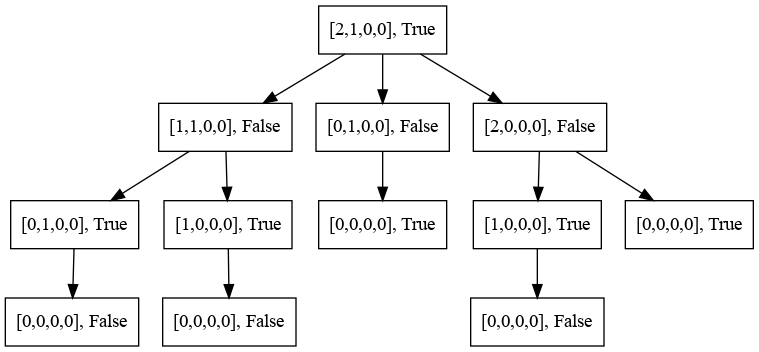
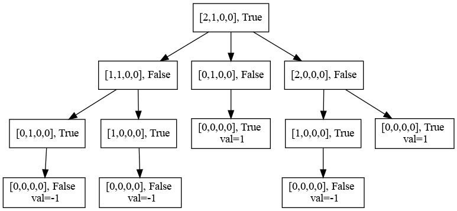
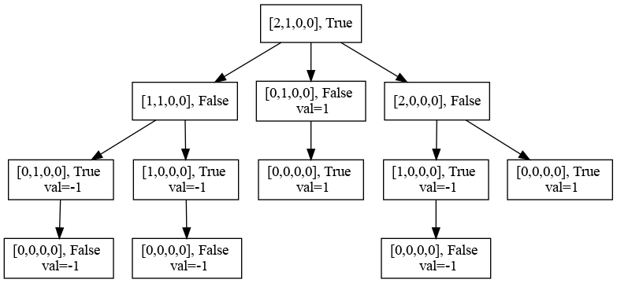
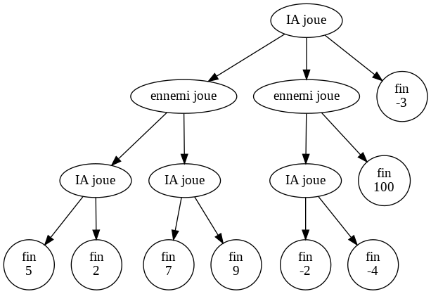

# wi-bash_minmax

Un cours rapide sur les algos min max.

L'algo **min max**, un algo qu'il est bien pour les jeux **a 2 joueurs**, à **tours alternés**.

## Les Ressources utiles
Ceci ne regroupe que les ressources nécéssaires pour le pseudo cours.

- le fichier source initial du jeu des allumettes, avec IA aléatoire : [solutionAlluInit.py](solutionAlluInit.py)
- [le fichier colab du min max](https://colab.research.google.com/drive/1OxcmON8R3eDTfXYQBKgaQ2Q8LSpyIgdS?usp=sharing)

## le plan (vite fait)

### l'arbre du jeu
C'est quoi...

- un noeud (configuration)
- des fils
- valeur des noeuds

Exemple pour le jeu des allumettes

en partant d'un plateau plus simple, pour simplifier :

Dans cette image, chaque noeud est défini par :
- le plateau (nombre d'allumettes par ligne)
- True si c'est a l'IA de jouer, False sinon

Au départ, c'est donc a l'IA de jouer et il y a 2 allumettes sur la première ligne, et 1 sur la seconde.

### Evaluations dans cet arbre
On va essayer de mettre une valeur sur chaque noeud.
On dit qu'on évalue le noeud. Les valeurs, dans notre cas, pourraient être 1 (l'IA gagne) ou -1 (l'IA perd).

Que sait on évaluer ?

1. Dans le cas du jeu des allumettes : les situations ou le plateau est vide. 2 cas :
- [0,0,0,0] , True : IA gagne (valeur 1)
- [0,0,0,0] , False : IA perd (valeur -1)

Ces situations sont des feuilles (pas de fils)

On peut donc un peu évaluer le graphe comme suit :

2. si un noeud n'a qu'un fils, sa valeur est la même que celle du fils.

Ca donnerait ca.

Puis, on peut trouver une solution plus générale :

3. Si un noeud a plusieurs fils tous évalués et que c'est à l'IA de jouer. Elle devrait choisir :
  - la meilleure solution pour elle
  - donc le max des possibilités
  - donc le noeud vaut : max ({eval(fils)})

4. Si un noeud a plusieurs fils tous évalués et que c'est à l'adversaire de l'IA de jouer. Il devrait (s'il est malin) jouer :
  - la meilleur solution pour lui
  - donc la pire pour nous:
  - donc le noeud vaut : min ({eval(fils)})

Bon, ben ca y est.

Quand je regarde ce nouveau graphe, je peux dire que si l'IA se retrouve dans la situation racine (en haut), ben elle a gagné.
Il suffit qu'elle joue au milieu.

Bon, ca c'est le principe.
Juste pour voir, essayez d'évaluer l'arbre du jeu imaginaire suivant :

## Reste à coder ca...

Et ca, on va le faire ensemble...
